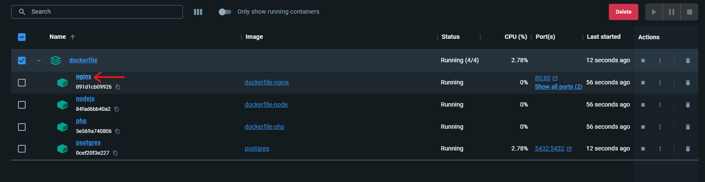
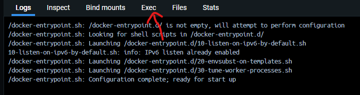

# Le Dockerfile

## Pré-requis

- avoir le CLI docker pour pouvoir lancer docker-compose
- utiliser le docker desktop sous windows pour se faciliter la vie niveau gestion et visibilité.

## Deploiement sous windows

- clones tout ça
- ouvres un terminal là où tu as ton docker-compose.yml et lances la command:
```bash
$ docker-compose up -d
```
Ca va monter toutes les images etc.

Pour que ce que j'ai fais là fonctionne correctement, il va y'avoir besoin d'indiquer une configuration à nginx pour qu'il capte les site php et node.

donc on rentre sur le nginx, sur le docker desktop,

on va dans les containers clique sur **"nginx"** puis sur **"exec"** pour ouvrir son terminal,

 

 

puis rdv dans le "default.conf":

```bash
$ cd etc/nginx/conf.d/
```

et ouvre avec nano:

```bash
$ cd etc/nginx/conf.d/
```

tout effacer (alt + supp depuis le bas pour aller plus vite)

et coller ça:

```conf
server {

    # PHP

    listen       80;
    server_name  localhost;

    root   /www;
    index index.php;
	
    location ~ \.php$ {

        try_files $uri =404;
        fastcgi_split_path_info ^(.+\.php)(/.+)$;
        fastcgi_pass php:9000;
        fastcgi_index index.php;
        include fastcgi_params;
        fastcgi_param SCRIPT_FILENAME $document_root$fastcgi_script_name;
        fastcgi_param PATH_INFO $fastcgi_path_info;

    }

}

server {
    
    # Node.js

    listen       81;
    server_name  localhost;

    location / {

        proxy_set_header Host $host;
        proxy_set_header X-Real-IP $remote_addr;
        proxy_set_header X-Forwarded-For $proxy_add_x_forwarded_for;
        proxy_set_header X-Forwarded-Proto $scheme;
        proxy_pass http://node:8887;

    }

}
```
on sauvegarde: ctrl + O

on quit: ctrl + X

on relance nginx pour qu'il prenne la conf:

```bash
$ /usr/sbin/nginx -s reload
```

## A savoir

Sur cette pile, il y'a donc actuellement:

- Debian + nginx:alpine + nano
- un "site en carton" php qui pointe sur localhost:80
- un "site en carton" nodejs qui pointe sur localhost:81, j'avais la possibilité, j'ai test, je l'enlèverai si vraiment j'en fais rien.
- postgresql dockerisé

Le postgres est dockerise en dev mais ne le sera pas en prod. C'est expliqué dans les tutos et de toute façon, en toute logique de sécurité dans notre contexte, on héberge le back et la base ensemble.
Pour vérifier la possibilité de connection à postgres, et d'une manière générale, j'utilise Dbeaver.
Evidemment, j'ai pris l'habitude de l'outils, mais libre à toi d'utiliser ce que tu veux.
Au cas où, si tu veux test, les paramètres de connexion à postgres quand tu vas créer la connexion sont, pour l'instant:

- host: localhost
- Database: postgres
- Nom d'utilisateur: postgres
- mdp: mysecretpassword

